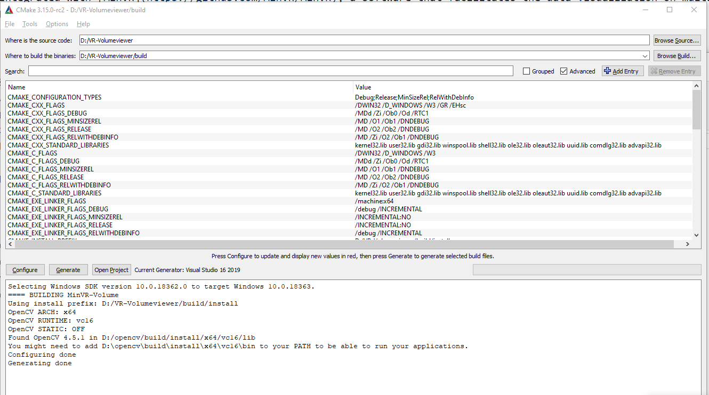
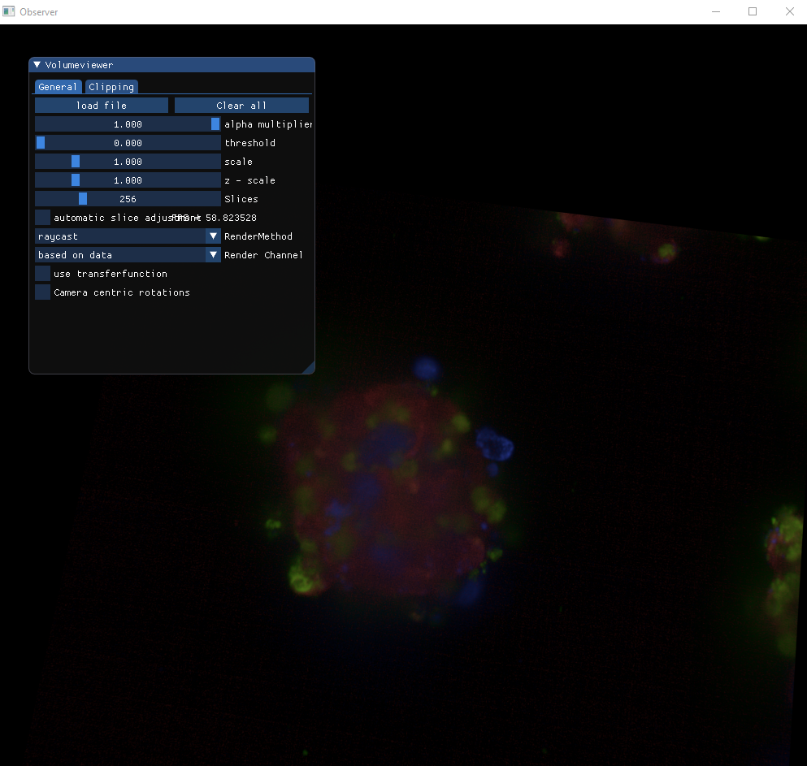
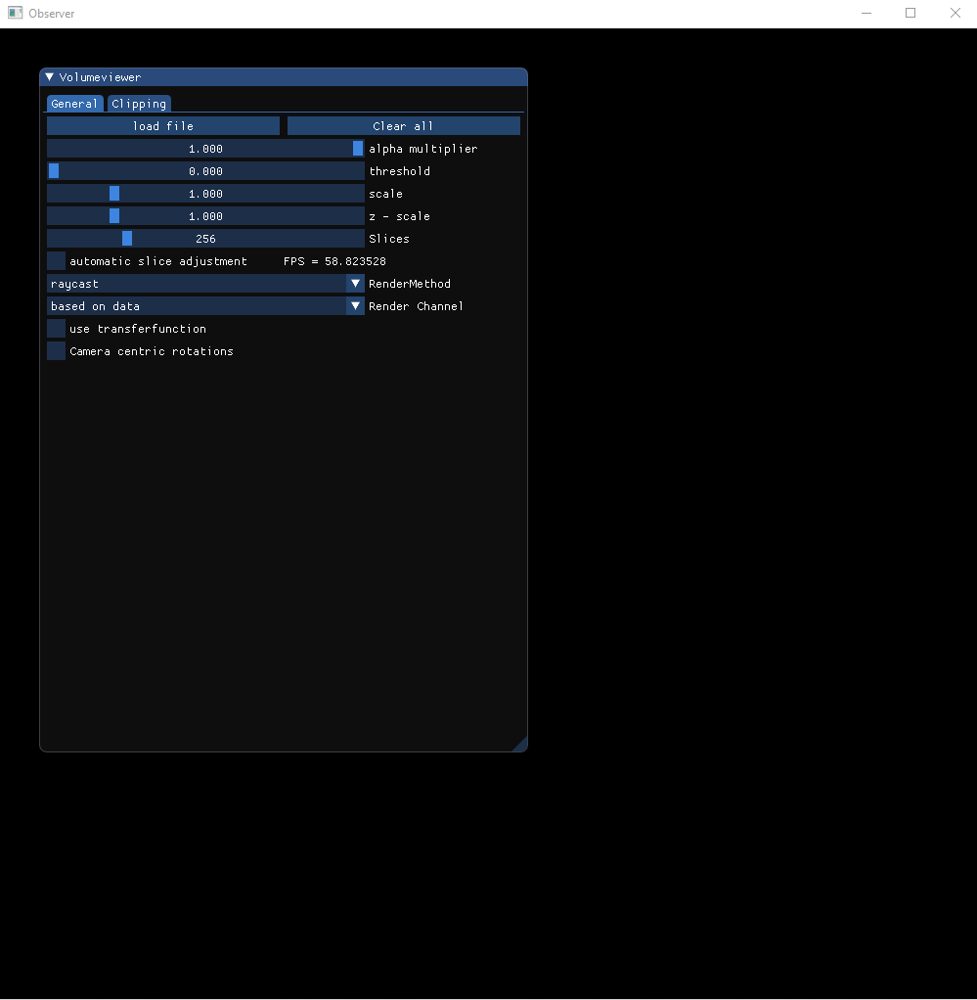

# VR-Volumeviewer
A simple viewer for visualizing volumetric datasets. It supports color mapping using transfer functions to map specific values of data to a scalar color. The view camera is fully interactive, and it works on multiple systems (Windows and Linux).
This tool is fully integrated with [MinVR](https://github.com/MinVR/MinVR), a software that facilitates the data visualization on multiple displays devices (desktop, VR HMDs,cave-systems).

### Requirements

* [Cmake 3.9 or greater ](https://cmake.org/)
* [VR-Imgui](https://github.com/brown-ccv/VR-imgui)
* [OpenCV](https://github.com/opencv/opencv)
* [MinVR](https://github.com/MinVR/MinVR)
* Support for OpenGL 3.3 or greater.
* [Teem](http://teem.sourceforge.net/download/index.html) *Make sure to build it with gzip support*

:warning: VR mode ONLY supported on Windows (You might need to download and install [steam](https://store.steampowered.com/steamvr)  )

### Build

1. Clone this git repository on your local system.
2. On the root folder (*cd VR-Volumeviewer*) create a folder and name it *build*
3. On Linux: Go to the previously created folder and run the command config.sh When the process ends run the command run.sh.
   On Windows: Execute the cmake gui tool and select visual studio as code Generator, and do click on configure. After the process ends, click on generate. (It has been tested on MSVS 2017 and 2019).
  
  
   
:warning: Some links to OpenCV and MinVR might have to be set manually.

### How to use it
  
It supports obj files for vertex mesheses, and [NRRD](http://teem.sourceforge.net/nrrd/format.html) file format for volume data.

### Loading data

Using the UI, click on *load file*, and in the next window navigate to the folder where your data is located. Select a file with nrrd or obj extension and click on "ok".




#### Description files
 
 To display more complex scenes, you must create a *description file* that contains line by line all the elements to be loaded.
 The following is an example on how a discription file looks like:
 
```
mesh OSOM_with_texture.obj 1
label Providence 282.3593  480.8620   57.0000 170 15 1
label Narragansett 222.3225  293.5203   71.3028 170 15 1
label Block_Island 172.3455  178.6527   60.9086 170 15 1
label New_London 48.6138  236.5409   85.3028 170 15 1
label New_Bedford 422.4869  326.0600   56.0115 170 15 1

```

You can insert meshes, volumes, 3d labels (billboard labels), and camera space labes (2d On screen text).


To load meshes and volumes, add a line indicating the type of data to load (mesh | volume) and the path to the location of the file.

```
mesh OSOM_with_texture.obj 1
```

```
volume temp_ocean_his_data/temp_ocean.nrrd 1 1 1 0 0 0 raycast 1
```

[RayCasting](https://en.wikipedia.org/wiki/Volume_ray_casting) indicates the algorithm the program uses to render volumes.
The meshes and volumes are rendered on the same space indicated in the data files.

```
label Providence 282.3593  480.8620   57.0000 170 15 1
```
To load labels, add a line starting with the word *label*, the text you want on to display, the size of the text (height & width), and the world coordinates where the text will be located.

### UI

Volume Viewer uses [Dear-Imgui](https://github.com/ocornut/imgui) as UI to control and manipulate data. The basic controllers give you the options to load meshes, clear the scene and clip the data on different axis. Also, it has support for color mapping.




To load a description file, do click on the *load file* button, a new ui window will be displayed with the local file system. Navigate to the description file's folder, select the .txt file and click *ok*


