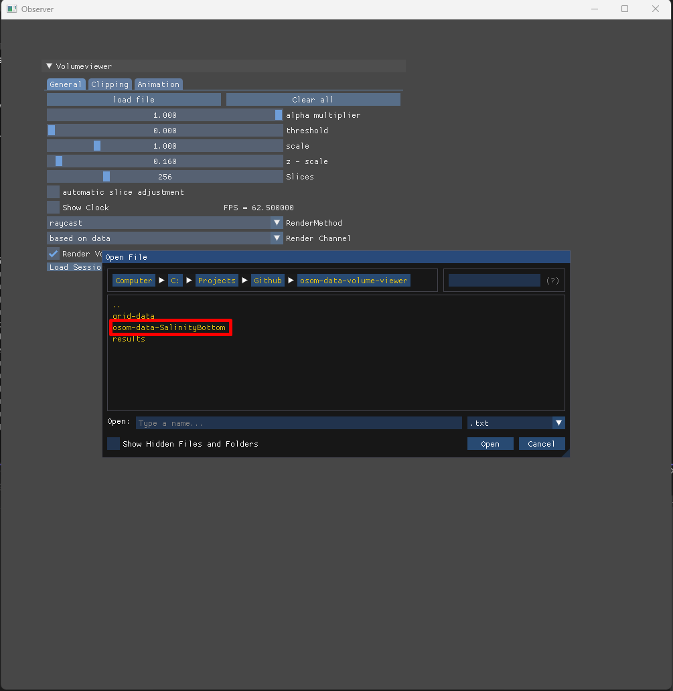
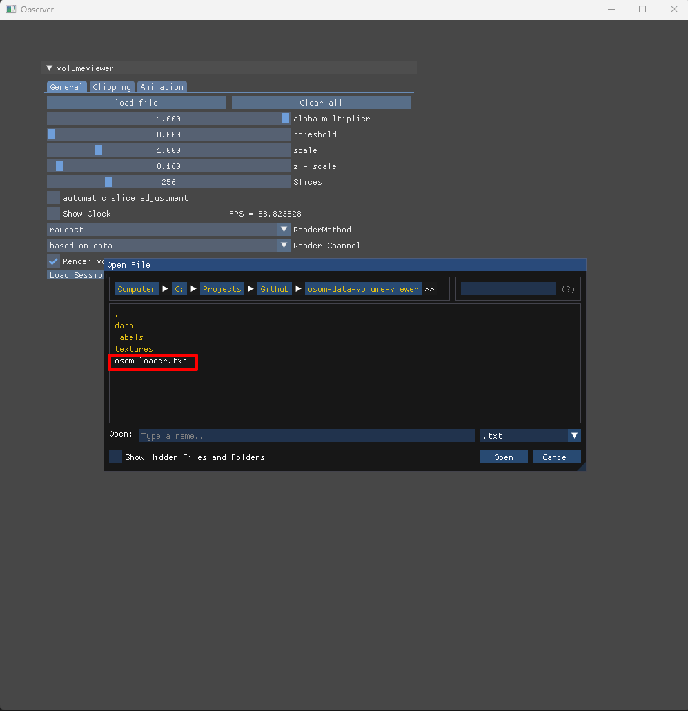
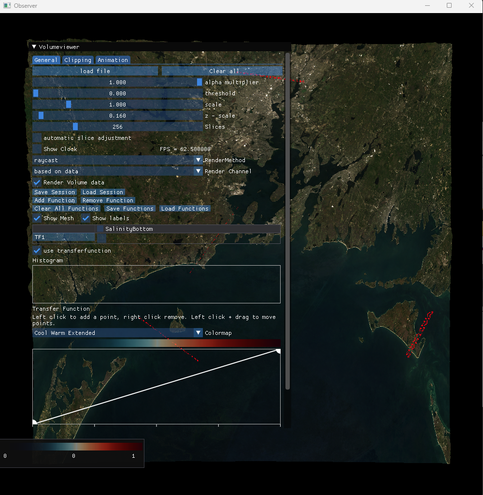
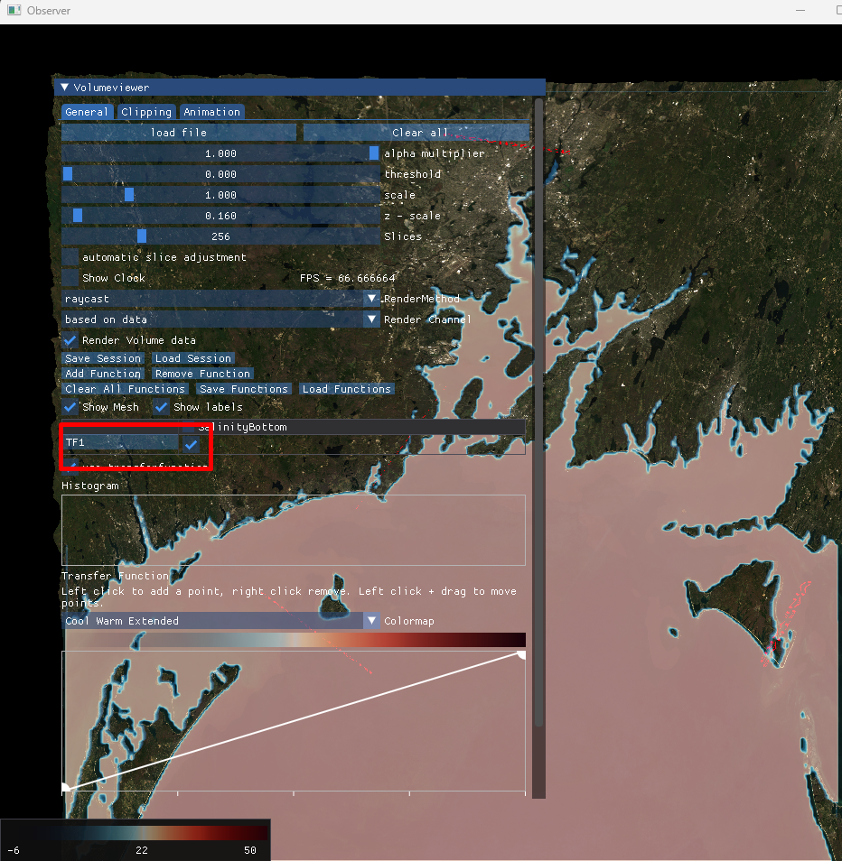

# Volume Viewer Documentation

The Volume viewer project was initialized by the [Center for computation and visuzalization](https://ccv.brown.edu/) (CCV) at Brown University as an opensource project to visualize [3D volume data](https://en.wikipedia.org/wiki/Volume_rendering) in the YURT ( Yurt Ultimate Reality Theater). It is build on top of  [MinVR](https://github.com/MinVR/MinVR) which is a multiplatform library to run C++/OpenGL applications in multiple devices (Monitor, VR headsets, CAVE multi display systems), allowing it to render volumes on Desktops and VR headsets without chaging a single line of code. Nowadays it works as simple tool to visualize data for the [Rhode Island Discovery Center](https://riddc.brown.edu/).
Currently it works on multiple platforms:

- Windows (Desktop and VR)
- Macos (Desktop)
- LInux (Desktop)

## Installation

The most recent release can be found at [https://github.com/brown-ccv/VR-Volumeviewer/releases]. Download the version that works on your local O.S.

## Installation for devs

1. Clone the [VolumeViewer](https://github.com/brown-ccv/VR-Volumeviewer) repo
2. In a temrinal go to `VolumeViewer/superbuild` folder
3. For `debug` build type:
    `cmake -S . -B .`
   For `release` build type:
    `cmake -S . -B . -DCMAKE_BUILD_TYPE=Release`
   `RelWithDebInfo` can be used on Windows.
4. Once all the dependencies have been downloaded and installed:
    On Windows go to the `superbuild` folder and open the Visual studio `VR-VolumeViewer.sln` solution. Right click on the VR-VolumeViewer project and select `build`
    On Macos and Linix type `make`

You should find inside the fodler `superbuild/bin` the `VR-VolumeViewer` executable.

### For Visual Studio on Windows devs

If you want to run the application from Visual Studio:

1. Open the `VR-VolumeViewer.sln` solution
2. Right click on the VR-VolumeViewer project and select `properties`
3. On the output folder section delete the last trail of the path so it points to the `bin` folder.
   i.e: Change `VR-Volumeviewer\bin\Debug`  to `VR-Volumeviewer\bin`
4. Right click on the VR-VolumeViewer project and select  `Set as Startup project`
5. You can run the application from the Visual Studio debugger.

## How to use it ?

### RIDDC Osom data visualizer

1. Go to the [RIDDC website](https://riddc-jupyter-book.web.app/notebooks/fox-kemper/first_example_aquarius.html)
2. At the left side index, select `Visualize OSOM data using OSOM 3D volume viewer`
3. At the top use the link to open the notebook on `Google Collab`
4. Follow the steps to produce and download the volume viewer package
5. Open the volume viewer application
    In the volume viewer root folder execute the file `bin/VR-VolumeViewer`

   

6. Click the `load file` button and locate the osom data folder you downloaded in step 4. Locate the `osom-loader.txt` file, and click `Open` (Or double click on the file)

   
   

7. Your RIDDC data has been loaded if you see the following image  

    

8. To visualize the volume, check the Transfer function to map on the volume data

  

9. The legend at the bottom left shows the minimum and maximun values of the dataset.